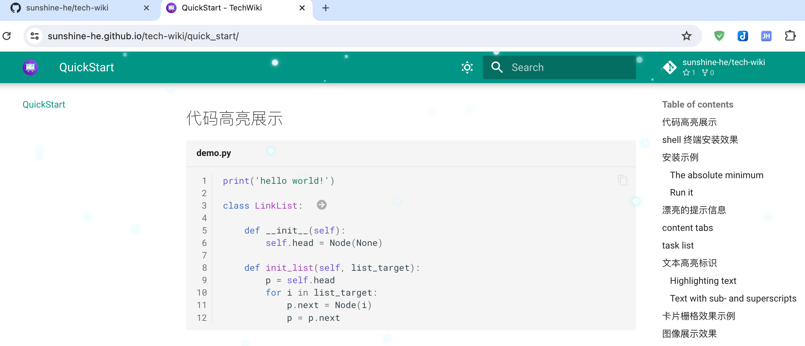
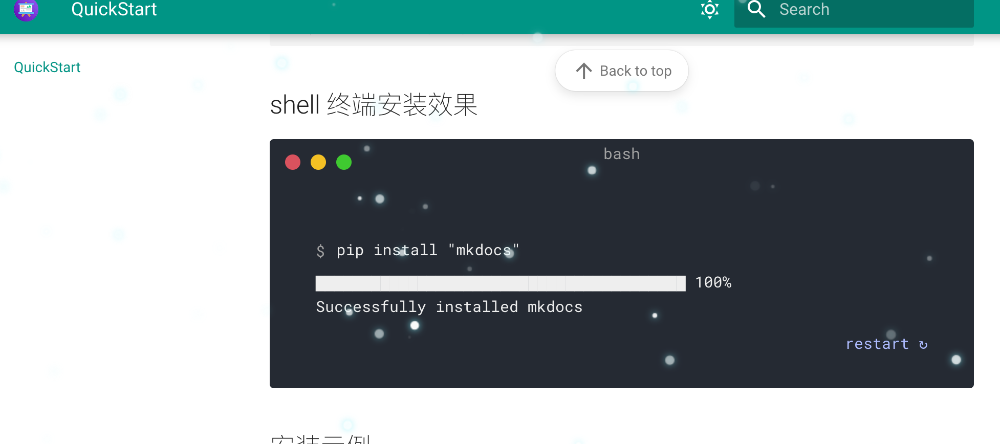

# write technology document or blog by markdown

# 一个非常适合用markdown写技术文档和博客的项目

## 功能简洁实用高效而且界面主题漂亮养眼，废话不多话，直接放几个截图看看效果吧。

**首页展示**

**代码高亮**

**终端安装程序效果展示**

**漂亮的提示信息**

**其他任务列表和文本格式效果等**

==还有更多哦，期待被发现== :smile:

演示地址： https://sunshine-he.github.io/tech-wiki/

需要搭建部署或定制开发的联系我。微信号：trustwin1688

欢迎赞助我，谢谢！

微信   支付宝

